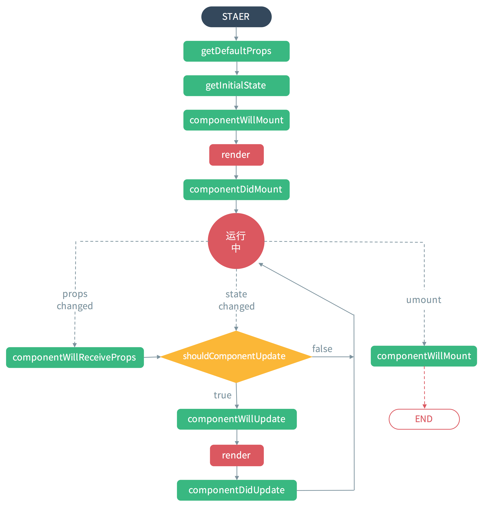

### 使用说明
- 项目脚手架：create-react-app
- 服务命令
  - npm start
  - npm test
  - npm run build
  - npm run eject

### 课程学习目标
- JSX语法:像写XML一样写js代码，使HTML代码可以写到js中
  - [中文文档](http://www.css88.com/react/docs/jsx-in-depth.html)

- 钩子函数,了解整个生命周期运行过程
    
 
- 使用this.setState注意三件事
  1. 不能直接更改state
    
    ```javascript
    // 错误
    this.state.comment = 'Hello';
    // 正确
    this.setState({comment: 'Hello'});
    ```
  2. state更新可能是异步的
    
    ```javascript
    //错误
    let n = 0;
    this.setState({
      counter: n++
    });
    console.log(n);//0
    
    //正确
    I.
      let n = 0;
      this.setState({
        counter: n++
      },
      () => { console.log(n) }
      );
    II.
      componentDidUpdate(){console.log(n);}
    III.
      //setTimeout内setState就会自动强制更新.
      let n = 0;
      setTimeout(() => {
        this.setState({
          counter: n++    
        });
        console.log(n);//1  
      });
    
    ``` 
    
    ```javascript
    根据先前的 state 设置 state
    // 错误
    this.setState({
      counter: this.state.counter + this.props.step,
    });
    // 正确
    this.setState((prevState, props) => ({
      counter: prevState.counter + props.step
    }));
    ```
  3. state更新会被合并
  
    ```javascript
    constructor(props) {
      super(props);
      this.state = {
        posts: [],
        comments: []
      };
    }
    componentDidMount() {
      fetchPosts().then(response => {
        this.setState({
          posts: response.posts
        });
      });
    
      fetchComments().then(response => {
        this.setState({
          comments: response.comments
        });
      });
    }
    ```   
- this.setState(obj)与this.setState(updateFun)本质区别
  - 运行周期内批处理 PK 加入队列一一处理
- Default Prop Values设置
  - [defaultProps文档](https://facebook.github.io/react/docs/typechecking-with-proptypes.html#default-prop-values)
- PropTypes(类型检测)设置
  - [PropTypes文档](https://facebook.github.io/react/docs/typechecking-with-proptypes.html#proptypes)
- [displayName设置](https://facebook.github.io/react/docs/react-component.html#displayname)
  - 作用:调试时便于查看组件名称
- 样式的应用
- React中的注释：
 1. 单行注释--

    > {/* 注释内容 */}

 2. 多行注释--

    > 
  /*
  注释1
  注释2
   */
   
  ``ps：切记不能用<!-- 注释 -->``
